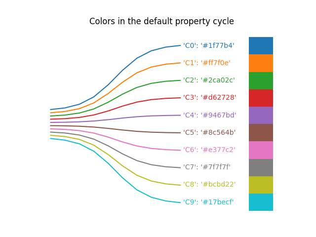

# plotcolours
Custom cycler for Python plotting.

This is my attempt after years of plotting and manually changing settings to streamline the process and settle on a personal style. The concept behind this solution is that the library can simply be imported when importing matplotlib/seaborn. All subsequent plots will automatically follow the style, including markers and hatching.

Paramount is readability when viewed in grayscale (as the happy owner of a grayscale Boox device and to accomodate printing) as well as accessibility to those suffering from colourblindness. The test scripts generate a few example plots in both colour and grayscale. Colourblindness is manually checked via [this simulator](https://www.color-blindness.com/coblis-color-blindness-simulator/).

I heavily recommend this solution for those interested, and feel free to tweak or swap the colours to your liking. The current settings are subject to change as this is the first version.

## Examples

| Colour graph                                    | Grayscale graph                                              |
| ----------------------------------------------- | ------------------------------------------------------------ |
|        |        |
|  |  |
|      |      |

| Matplotlib default                                    | Plotcolours                                             |
| ----------------------------------------------- | ------------------------------------------------------------ |
|        |        |
|  |  |

